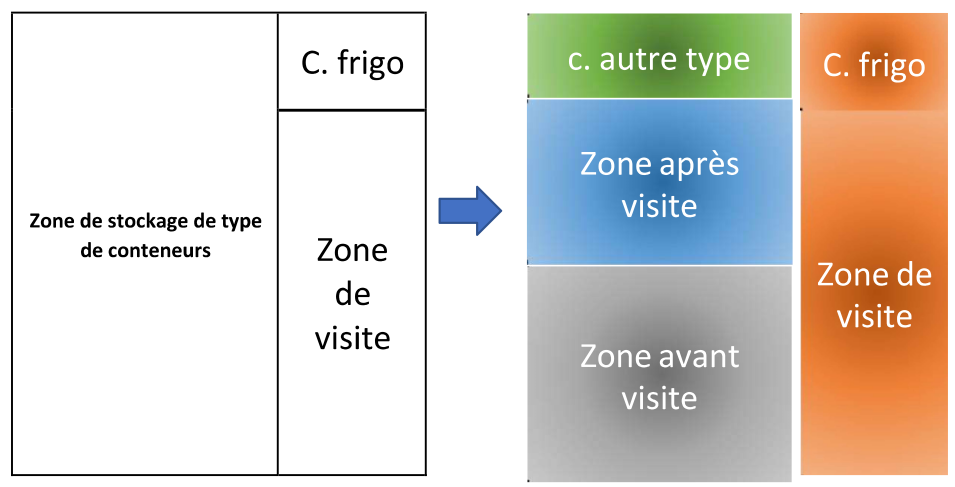
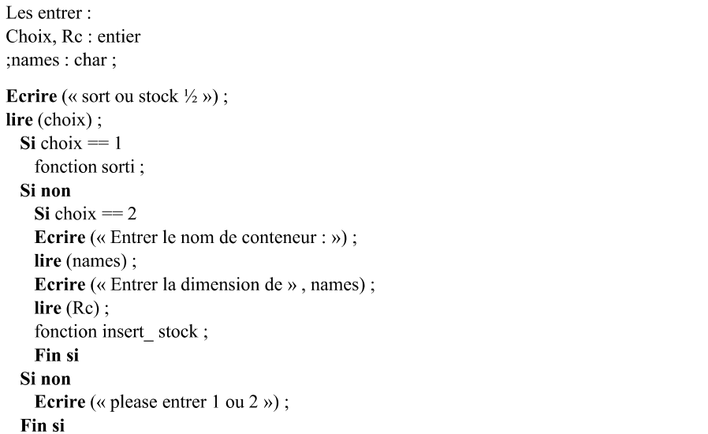
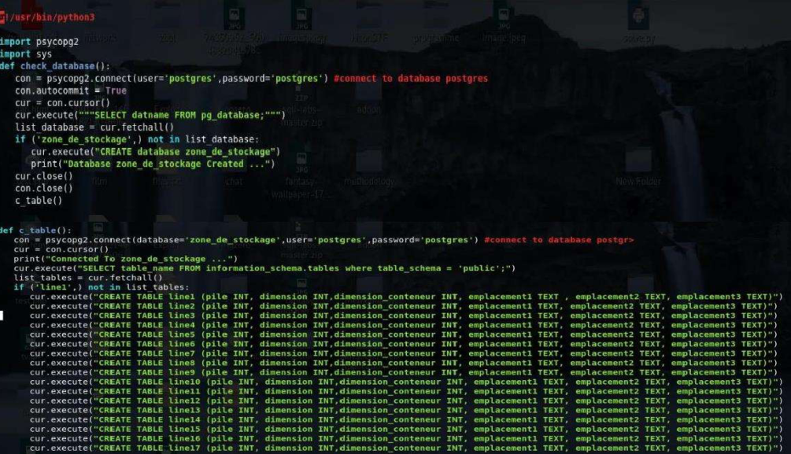
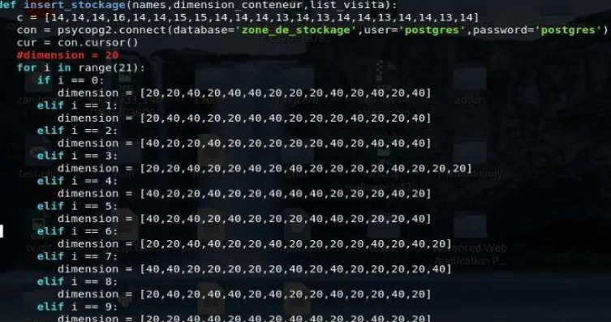
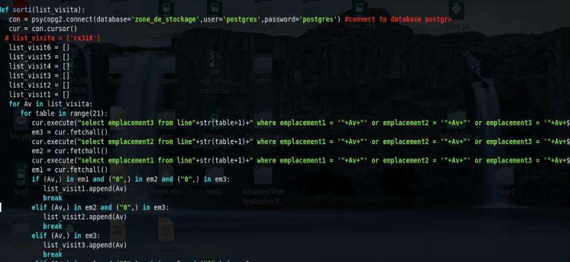
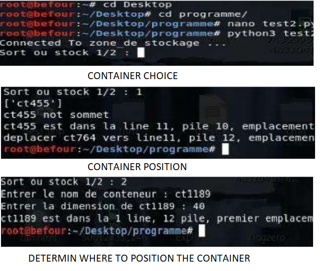
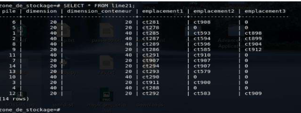

# Container Stacking Optimization at the Port of Oran

**MSc Thesis — Industrial Engineering & Logistics**
Djalil Ben Hamla — Ecole Supérieure des Sciences Appliquées de Tlemcen (ESSAT)
📍 Birmingham, UK • 📧 [djalilb18896@gmail.com](mailto:djalilb18896@gmail.com)

---

##  Abstract

This project applies Lean methods and discrete-event simulation (Arena) to optimize container stacking and yard operations at the Port of Oran. The aim was to reduce crane re-handles, lower container dwell time, and increase throughput by redesigning stacking logic and yard layout. The thesis demonstrates measurable improvements in handling efficiency and waiting times through redesigned stacking rules and operational standards.

---

##  Problem Statement

Container yards at ports often suffer from inefficient stacking strategies, causing:

* Unnecessary crane re-handles
* Increased container dwell time
* Longer crane travel distances
* Higher operational costs

This project investigated stacking logic and yard layout alternatives to minimize re-handles while maintaining or increasing throughput.

---

##  Objectives

* Reduce crane re-handling moves.
* Decrease container dwell time.
* Increase yard throughput with minimal additional resources.
* Provide implementable SOPs and visual management for yard teams.

---

##  Methodology

1. **Process mapping & value-stream analysis** (Lean)
2. **Data collection**: yard flows, arrival schedules, crane moves, container types
3. **Model building**: discrete-event simulation using **Arena**
4. **Scenario testing**: compare baseline vs. multiple stacking strategies
5. **Validation & sensitivity analysis**
6. **Recommendations & SOPs** for implementation

---

##  Key Results

* **~30% reduction** in crane re-handles in the optimized scenario
* Significant **reduction in container dwell time** (exact % from thesis)
* Improved throughput per crane and smoother yard traffic patterns
* Practical implementation roadmap with SOPs and visual guides

---

##  Tools & Technologies

* **Arena Simulation** (Discrete-event simulation)
* **Excel** (data processing & scenario inputs)
* **Power BI** (dashboards & KPI visualization)
* **Lean tools** (VSM, 5S, Kaizen, root cause analysis)

---

##  Deliverables

* 📄 Full thesis (PDF) — [**Download Here**](https://raw.githubusercontent.com/djalilben-ship-it/PORT-Container-Stacking/main/Container_Stacking_Thesis.pdf)
* Arena model & simulation files (on request)
* Power BI dashboard screenshots
* Implementation SOPs & layout diagram

---

##  Visuals

* Yard optimization:  
  

* Algorithm:  
  

* Database creation:  
  

* Stacking function:  
  

* Exit function:  
  

* Position optimization:  
  

* Real-time database update:  
  

##  Video / Demo

---

##  Implementation Roadmap

1. Pilot new stacking logic in one yard zone for 4 weeks.
2. Monitor KPIs (dwell time, re-handles, crane idling).
3. Train operators & adjust rules.
4. Roll out across the yard with visual SOPs.

---

##  Contact

📧 Email: [djalilb18896@gmail.com](mailto:djalilb18896@gmail.com)
🔗 LinkedIn: [linkedin.com/in/djalil-ben-h](https://linkedin.com/in/djalil-ben-h)
